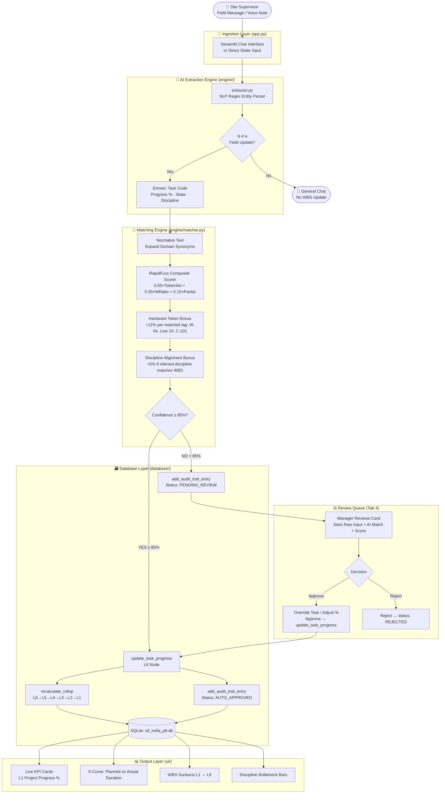
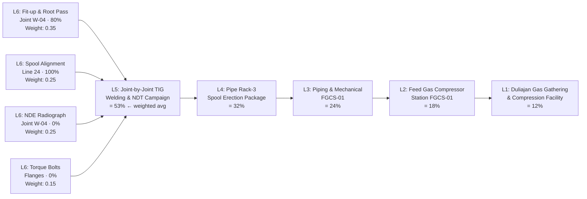
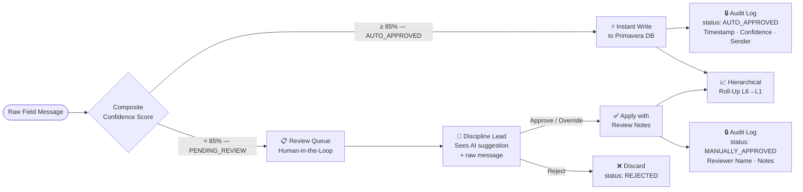

# 🛢️ Auto-Link P6 — Intelligent Schedule-Linking Layer
### SIH 2026 · Problem Statement PS26122 · Client: Oil India Limited

> **Bridging informal site reports to Oracle Primavera P6 WBS nodes in < 300 ms — with zero training required for ground crews.**

[](https://python.org)
[](https://streamlit.io)
[](tests/test_engine.py)
[](database/)
[](LICENSE)

---

## 📌 Problem Statement

Large oil & gas infrastructure projects suffer from a critical information gap: **ground-level progress is invisible for weeks at a time.** Field supervisors post status updates in WhatsApp groups or handwritten logbooks, but linking those informal messages to the official Oracle Primavera P6 WBS requires planning engineers to manually scroll through thousands of L5/L6 tasks — a process that takes 2–3 days per reporting cycle and is prone to transcription errors, omissions, and contractor billing disputes.

**The result:** Project directors make decisions on data that is 2 to 4 weeks stale.

---

## ✅ What This System Does

```
"Erected Line 24 spool at Rack 3, completed 80% welding on Joint W-04"
                              ↓  (< 300ms)
  🤖  Auto-matched → OIL-L6-07: Fit-up & Root Pass TIG Welding, Joint W-04 Line 24
  📊  Confidence: 94.3%  →  AUTO_APPROVED  →  L6 → L5 → L4 → L3 → L2 → L1 rollup recalculated
```

| Capability | Status |
| :--- | :---: |
| Entity Extraction from free-text field messages | ✅ Live |
| Confidence-gated fuzzy matching (RapidFuzz) | ✅ Live |
| Auto-approval gate at ≥ 85% confidence | ✅ Live |
| Human-in-the-loop Review Queue (< 85%) | ✅ Live |
| Weighted L6 → L1 hierarchical progress rollup | ✅ Live |
| Immutable audit trail (sender, role, timestamp, score) | ✅ Live |
| Plotly analytics: Sunburst, S-Curves, Discipline bars | ✅ Live |
| Role simulation (Director, Lead, Supervisor) | ✅ Live |
| WBS Schedule Explorer with live filters | ✅ Live |
| CSV Master Schedule export | ✅ Live |

---

## 🗂️ WBS Database Coverage

The bundled SQLite database (`oil_india_p6.db`) models a **real Oil India gas gathering & compression project** across 6 WBS levels:

| Level | Count | Represents | Example |
| :---: | :---: | :--- | :--- |
| **L1** | 1 | Macro Project | Duliajan Central Gas Gathering & Compression |
| **L2** | 3 | Plant / Sub-Project | Gas Dehydration Unit-3, Compressor Station |
| **L3** | 5 | Discipline Package | Civil & Structural Foundations — Compressor Area |
| **L4** | 5 | Work Package / Area | Pipe Rack 3 Spool Erection & Welding Package |
| **L5** | 5 | Work Activity | Joint-by-Joint TIG Welding & NDT Campaign |
| **L6** | 14 | Executable Daily Task | Fit-up & Root Pass Welding, Joint W-04, Line 24 |
| **Total** | **33** | **Full WBS hierarchy** | **19 matchable L5/L6 target tasks** |

**Disciplines covered:** Piping & Mechanical (12) · Civil & Structural (10) · Electrical & Instrumentation (7) · Quality & Testing (3) · Project Management (1)

---

## 🔄 System Architecture & Data Flow

### End-to-End Pipeline



---

### Hierarchical WBS Rollup Logic



---

### Confidence Gate & Governance



---

## 🚀 Quick Start

### Prerequisites
- Python **3.9 – 3.14**
- `pip` package manager

### 1. Clone / Unzip the Project
```bash
# If using git
git clone <repository-url>
cd Plan-B

# Or unzip the shared archive
unzip Oil_India_Schedule_Linking_Layer.zip
cd Oil_India_Schedule_Linking_Layer
```

### 2. Install Dependencies
```bash
pip install -r requirements.txt
```

**Dependencies:** `streamlit>=1.35.0` · `rapidfuzz>=3.8.0` · `pandas>=2.0.0` · `plotly>=5.20.0` · `pytest>=8.0.0`

### 3. Launch the Dashboard
```bash
streamlit run app.py
```

> **Windows shortcut:** Double-click `run.bat` — it installs dependencies and launches automatically.

Open your browser at **http://localhost:8501**

### 4. Run the Test Suite
```bash
python -m pytest -v
```

Expected output: **6/6 tests passing** in < 2 seconds.

```
tests/test_engine.py::test_extractor_percentages_and_intent          PASSED
tests/test_engine.py::test_extractor_fraction_progress               PASSED
tests/test_engine.py::test_high_confidence_auto_approval_matching    PASSED
tests/test_engine.py::test_low_confidence_pending_review_matching    PASSED
tests/test_engine.py::test_hierarchical_rollup_math                  PASSED
tests/test_engine.py::test_review_queue_approval_workflow            PASSED
```

---

## 📂 Project Structure

```
Plan-B/
│
├── app.py                    # Main Streamlit application (6 dashboard tabs)
├── requirements.txt          # Python dependencies
├── run.bat                   # Windows one-click startup script
├── PS26-122.pdf              # Official SIH problem statement specification
├── oil_india_p6.db           # Pre-seeded SQLite database (33-node WBS hierarchy)
├── README.md                 # This file
├── .gitignore                # Excludes __pycache__, .pytest_cache, *.pyc, *.zip
│
├── database/                 # ── Data Layer ──────────────────────────────────────
│   ├── schema.py             # SQLite DDL: tasks, chat_messages, audit_trail, uploads
│   ├── seed_data.py          # Synthetic Primavera P6 WBS (33 tasks, L1–L6)
│   └── db_manager.py         # CRUD operations, rollup engine, review queue logic
│
├── engine/                   # ── AI & Matching Core ───────────────────────────────
│   ├── extractor.py          # Regex NLP: intent detection, % extraction, state parsing
│   └── matcher.py            # RapidFuzz scorer: Token-Set + WRatio + token bonuses
│
├── ui/                       # ── Presentation Layer ───────────────────────────────
│   ├── styles.py             # Dark-themed CSS: glassmorphism, Oil India palette
│   ├── components.py         # Chat bubbles, metric cards, audit table, WBS cards
│   └── analytics.py          # Plotly: S-Curves, Sunburst, Discipline bars, Donut
│
└── tests/                    # ── Quality Assurance ────────────────────────────────
    └── test_engine.py        # 6 pytest tests: extraction, matching, rollup, workflow
```

---

## 🎯 Dashboard Tabs

| Tab | What It Does |
| :--- | :--- |
| **💬 Time Agent & Field Chat** | Chat interface with quick-test message buttons. Sends text through the full extraction → matching → DB pipeline in real time. Shows AI match chips with confidence score inline. |
| **🏗️ WBS Schedule Hierarchy** | Filterable (Level + Discipline + keyword search) live view of all 33 WBS nodes with progress bars, weights, parent links, and planned vs. actual durations. |
| **📋 Live Audit Trail** | Searchable, filterable immutable log of every field update — auto-approved, pending, manually approved, or rejected — with full extraction metadata. |
| **⚖️ Review Queue** | Cards for all < 85% confidence matches. Leads can remap to the correct task, override the percentage, write justification notes, and approve or reject with 1 click. |
| **📊 Analytics & Bottlenecks** | 4-chart Plotly dashboard: Planned vs. Actual Duration bars, Discipline Progress horizontals, Status Distribution donut, and interactive WBS Sunburst. |
| **📁 Master Schedule & Ingestion** | Full WBS table view with live CSV export of all 33 tasks. Accepts uploaded CSV files for synthetic ingestion preview. |

---

## 🛠️ Technology Stack

| Layer | Technology | Why |
| :--- | :--- | :--- |
| **Frontend / Dashboard** | [Streamlit 1.35+](https://streamlit.io/) | Rapid prototyping, Python-native, no JS boilerplate |
| **Matching & NLP** | [RapidFuzz 3.8+](https://github.com/maxbachmann/RapidFuzz) | C-accelerated Levenshtein + token distance, 100× faster than pure difflib |
| **Analytics** | [Plotly 5.20+](https://plotly.com/python/) | Interactive charts, Sunburst, consistent dark theme |
| **Data Wrangling** | [Pandas 2.0+](https://pandas.pydata.org/) | WBS filtering, CSV export, analytics aggregations |
| **Storage** | SQLite3 (WAL mode, foreign keys) | Zero-config embedded DB; upgrade path to PostgreSQL |
| **Testing** | [Pytest 8.0+](https://pytest.org/) | Deterministic unit tests with temp DB fixture |

---

## 🏗️ How the Matching Score is Computed

Every incoming field message is scored against each of the **19 matchable L5/L6 WBS tasks**:

$$\text{Composite Score} = 0.50 \times \text{TokenSetRatio} + 0.35 \times \text{WRatio} + 0.15 \times \text{PartialRatio}$$

**Bonus boosts (applied after base score):**
- **+12 points per matching hardware token** (e.g. `W-04`, `Line 24`, `C-101`, `11kV`) — capped at 100
- **+5 points if inferred discipline matches the WBS task's discipline**

**Result routing:**
- Score **≥ 85%** → `AUTO_APPROVED` → instant database write + rollup
- Score **< 85%** → `PENDING_REVIEW` → enters Review Queue for human verification

---

## 📊 Verified Test Scenarios

| Test Case | Input Message | Expected Outcome | Result |
| :--- | :--- | :--- | :---: |
| **Explicit %** | "Spool erected on line 24 at Rack 3, completed 80% welding on Joint W-04" | `is_update=True`, `progress=80.0%`, `discipline=Piping & Mechanical` | ✅ |
| **Fraction progress** | "Cable pulling ongoing, pulled 3 out of 4 segments" | `progress=75.0%` | ✅ |
| **High-confidence match** | "Fit-up & Root Pass TIG Welding on Joint W-04 Line 24" | Matches `OIL-L6-07`, confidence ≥ 85%, `AUTO_APPROVED` | ✅ |
| **Low-confidence ambiguity** | "Worked on some equipment near the station" | Confidence < 85%, `PENDING_REVIEW` | ✅ |
| **Rollup math** | Update `OIL-L6-07` to 100% | L5 parent recalculates to 60% (weighted), L1 progress > 0% | ✅ |
| **Review queue workflow** | Submit 78% confidence item → Lead approves at 70% | Task updates to 70%, removed from queue | ✅ |

---

## 🔮 Roadmap (Production Hardening)

- [ ] **LLM-backed extraction** — Swap regex with Gemini/LLaMA prompt for complex multilingual field messages
- [ ] **Voice input** — Integrate Whisper ASR or browser Web Speech API
- [ ] **Vector search** — FAISS/ChromaDB embeddings for 10,000+ task schedules at enterprise scale
- [ ] **Full CSV ingestion** — Auto-parse and merge uploaded Primavera export CSVs into the live schedule
- [ ] **True RBAC** — Enforce role-level restrictions on Review Queue, DB reset, and admin actions
- [ ] **Actual duration tracking** — Increment `actual_duration` automatically from sequential field updates
- [ ] **PostgreSQL backend** — Production-grade persistent storage replacing SQLite

---

## 📄 License

MIT License — see [LICENSE](LICENSE) file for full terms.

---

*Built for Smart India Hackathon 2026 — Oil India Limited, Duliajan, Assam.*
