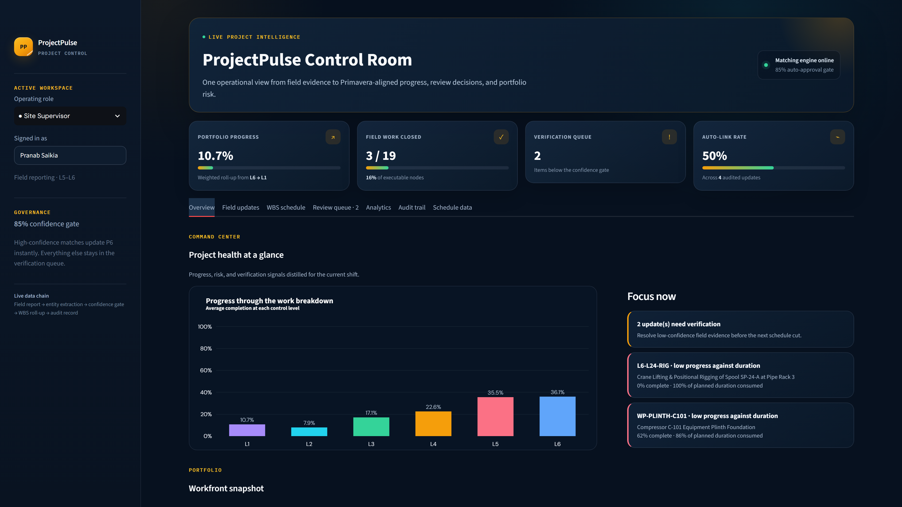
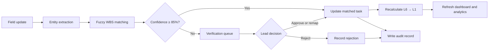

# ProjectPulse

> A field-to-schedule project control dashboard that converts informal site updates into auditable Primavera-style WBS progress.

[](https://python.org)
[](https://streamlit.io)
[](tests/test_engine.py)
[](database/)

ProjectPulse gives project teams one operational view of field evidence, schedule progress, verification work, and delivery risk. A supervisor can submit a plain-language update such as:

```text
Erected Line 24 spool at bay 1, completed 80% welding on Joint W-04
```

The application extracts the progress, identifies the likely L5/L6 schedule node, applies an 85% confidence gate, records the decision, and recalculates the weighted L6 → L1 hierarchy.

## Visual preview



Responsive previews: [tablet landscape](assets/dashboard-mockups/projectpulse-dashboard-tablet-landscape.png) · [mobile landscape](assets/dashboard-mockups/projectpulse-dashboard-mobile-landscape.png)

## What is included

- Executive command center with portfolio KPIs, WBS-level progress, workfront cards, risk signals, and recent activity.
- Field evidence inbox for free-text supervisor updates and direct audited task adjustments.
- Rule-based extraction of progress, operational state, task text, and discipline hints.
- RapidFuzz matching against executable L5/L6 schedule nodes.
- Automatic schedule updates for matches at or above 85% confidence.
- Human verification queue for ambiguous matches below 85%.
- Weighted progress roll-up across the full L1–L6 hierarchy.
- Searchable WBS explorer with level, discipline, and keyword filters.
- Immutable audit trail for automatic, pending, approved, and rejected updates.
- Interactive Plotly analytics for duration burn, discipline progress, task status, and hierarchy exploration.
- CSV schedule export and validated CSV upsert with parent relationship checks.
- Role-aware review, import, reset, and update controls.
- Responsive dark interface with streamlined ProjectPulse branding.

## Dashboard

| Workspace | Purpose |
| --- | --- |
| **Overview** | Shared command center with KPIs, WBS progress, focus items, workfronts, recent decisions, and data-quality indicators. |
| **Field updates** | Submit free-text evidence, inspect confidence results, and apply direct audited progress updates. |
| **WBS schedule** | Browse and filter every L1–L6 schedule node with progress, weight, parent, discipline, and duration data. |
| **Review queue** | Confirm, remap, adjust, approve, or reject evidence that falls below the confidence threshold. |
| **Analytics** | Compare duration burn, discipline performance, status distribution, and the interactive WBS hierarchy. |
| **Audit trail** | Filter the complete decision history by approval status. |
| **Schedule data** | Inspect the master schedule, export CSV, and import validated schedule changes. |

### Role behavior

Role selection changes the active identity, scope label, permissions, and audit attribution. The main Overview metrics and charts currently remain shared across roles.

| Capability | Project Director | Discipline Lead | Site Supervisor |
| --- | :---: | :---: | :---: |
| Submit field updates | Yes | Yes | Yes |
| Direct audited progress update | Yes | Yes | Yes |
| Approve or reject review items | Yes | Yes | Read-only |
| Import schedule CSV | Yes | Yes | Read-only |
| Reset demonstration data | Yes | No | No |

The role selector is application-level access control for the demonstration. It is not connected to an external identity provider or SSO system.

## Processing flow


```mermaid
flowchart LR
    A[Field update] --> B[Entity extraction]
    B --> C[Fuzzy WBS matching]
    C --> D{Confidence ≥ 85%?}
    D -- Yes --> E[Update matched task]
    D -- No --> F[Verification queue]
    F --> G{Lead decision}
    G -- Approve or remap --> E
    G -- Reject --> H[Record rejection]
    E --> I[Recalculate L6 → L1]
    E --> J[Write audit record]
    H --> J
    I --> K[Refresh dashboard and analytics]
```

### Matching score

Each incoming update is compared with the 19 matchable L5/L6 nodes in the bundled schedule:

```text
Composite score = 0.50 × TokenSetRatio
                + 0.35 × WRatio
                + 0.15 × PartialRatio
```

The matcher then applies:

- A 12-point bonus for each matching equipment, line, or joint token such as `W-04`, `Line 24`, or `C-101`.
- A 5-point bonus when the inferred discipline aligns with the schedule task.
- A final clamp to the 0–100 range.

Results at or above 85% are marked `AUTO_APPROVED`. Lower scores are marked `PENDING_REVIEW`.

## Schedule model

The bundled SQLite database contains a 33-node demonstration schedule:

| Level | Nodes | Represents |
| :---: | ---: | --- |
| L1 | 1 | Portfolio project |
| L2 | 3 | Facility or major sub-project |
| L3 | 5 | Discipline package |
| L4 | 5 | Area work package |
| L5 | 5 | Work activity |
| L6 | 14 | Executable field task |
| **Total** | **33** | **19 matchable L5/L6 nodes** |

Parent progress is recalculated as a weighted average of its immediate children. Updates propagate from L6 through L5, L4, L3, L2, and finally L1.

## CSV schedule import

The Schedule data workspace accepts Primavera-style CSV files. Required columns are:

```text
id, code, level, name, discipline
```

Supported optional columns include:

```text
parent_id, description, weight, planned_duration, actual_duration,
planned_start, planned_end, progress_pct, status
```

Import behavior:

- Existing task IDs are updated.
- New task IDs are inserted.
- Duplicate IDs in the same upload are rejected.
- Levels must be `L1` through `L6`.
- Non-L1 rows must reference an existing parent or a parent included in the same upload.
- Progress is clamped to 0–100 and numeric fields are validated.
- The hierarchy is recalculated after a successful transaction.
- Import does not delete schedule rows.

## Quick start

### Requirements

- Python 3.9–3.14
- `pip`

### Install and run

```bash
pip install -r requirements.txt
streamlit run app.py
```

Open [http://localhost:8501](http://localhost:8501).

On Windows, `run.bat` provides a one-click installation and launch flow.

### Run tests

```bash
python -m pytest -q
```

Expected result:

```text
.........                                                                [100%]
9 passed
```

The test suite covers:

- Explicit and fractional progress extraction.
- High- and low-confidence matching paths.
- Hierarchical roll-up calculations.
- Review queue approval workflow.
- CSV updates and invalid-parent rejection.
- Dashboard insight output.

## Project structure

```text
ProjectPulse/
├── app.py                    # Streamlit application and seven workspaces
├── requirements.txt          # Runtime and test dependencies
├── run.bat                   # Windows launcher
├── oil_india_p6.db           # Pre-seeded 33-node demonstration schedule
├── database/
│   ├── db_manager.py         # CRUD, roll-up, insights, review, and CSV upsert
│   ├── schema.py             # SQLite schema and indexes
│   └── seed_data.py          # Demonstration WBS and initial field messages
├── engine/
│   ├── extractor.py          # Intent, state, percentage, and discipline extraction
│   └── matcher.py            # Normalization and composite fuzzy matching
├── ui/
│   ├── analytics.py          # Plotly figures and shared chart configuration
│   ├── components.py         # Safe reusable UI components and role definitions
│   └── styles.py             # Responsive ProjectPulse design system
└── tests/
    └── test_engine.py        # Nine deterministic integration and unit tests
```

## Technology

| Layer | Technology |
| --- | --- |
| Application UI | Streamlit |
| Data analysis and CSV | pandas |
| Interactive charts | Plotly |
| Fuzzy matching | RapidFuzz, with a standard-library fallback |
| Entity extraction | Python regular expressions |
| Persistence | SQLite with foreign keys |
| Testing | pytest |

## Current limitations

- Extraction is rule-based and works best when updates contain a task keyword, identifiable asset, and explicit percentage.
- Matching scans all candidate nodes and would need indexing or vector retrieval for enterprise schedules with thousands of tasks.
- Role controls are simulated inside the app and do not provide production authentication.
- CSV import performs validated upserts but not destructive synchronization or deletion.
- Actual duration does not automatically increase from sequential field updates.
- The bundled database is demonstration data rather than a live Primavera connection.

## Next steps

- Add multilingual or LLM-assisted entity extraction for complex field language.
- Add indexed or vector-assisted retrieval for large schedules.
- Connect roles to SSO and persistent user identities.
- Synchronize with a live Primavera or PostgreSQL backend.
- Add automatic actual-duration and earned-value calculations.
- Introduce role-specific Overview layouts while preserving shared portfolio metrics.
